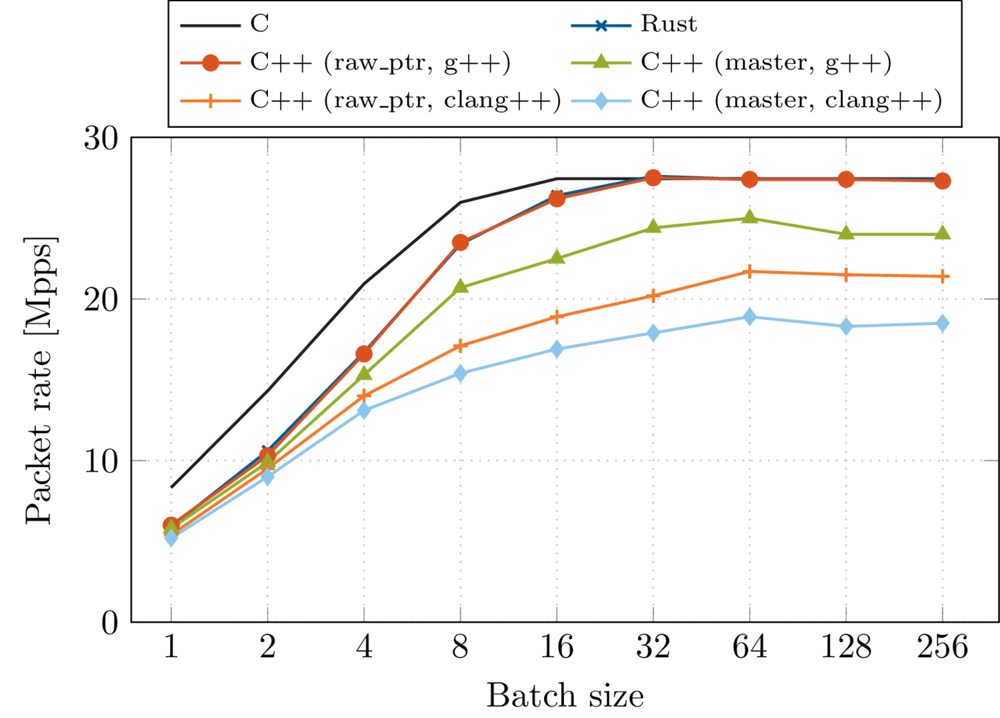

# ixy.cpp

ixy.cpp is a C++ rewrite of the [ixy userspace network driver](https://github.com/emmericp/ixy).
It is designed to be readable, idiomatic C++ code.
It supports Intel 82599 10GbE NICs (`ixgbe` family).

## Features

* driver for Intel NICs in the `ixgbe` family, i.e. the 82599ES family (aka Intel X520)
* super fast, can forward > 26 million packets per second on a single 3.3 GHz CPU core
* super simple to use: no dependencies, no annoying drivers to load, bind, or manage - see step-by-step tutorial below
* just 1000 lines of C++ code for a packet forwarder including the whole driver
* no kernel modules needed
* support for multiple device queues
* MIT license

## Build instructions

### Caution
**Your NIC has full DMA access to your memory. A misconfigured NIC will cause memory corruptions that might crash your server or even destroy your filesystem**.
Do not run this on any systems that have anything remotely important on them if you want to modify the driver.
Our version is also not necessarily safe and might be buggy.
You have been warned.

**Running ixy.cpp will unbind the driver of the given PCIe device without checking if it is in use.**
This means the NIC will disappear from the system.
Do not run this on NICs that you need.

We currently have a simple check if the device is actually a NIC, but trying to use another device could crash your system.

1. Install the following dependencies
	* g++ >= 8.0
	* make
	* cmake
	
	Run this on Debian/Ubuntu to install them:
	
	```
	sudo apt-get install -y build-essential cmake
	```
2. Configure 2MB hugepages in /mnt/huge using our script:

	```
	cd ixy.cpp
	sudo ./setup-hugetlbfs.sh
	```
	
3. Run cmake and make

	```
	cmake -DCMAKE_BUILD_TYPE=Release .
	make
	```
4. That's it! You can now run the included examples, e.g.:

	```
	sudo ./forwarder 0000:AA:BB.C 0000:DD:EE.F
	```
	
	Replace the PCI address as needed. All examples expect fully qualified PCIe bus addresses, i.e., typically prefixed with `0000:`, as arguments.
	You can use `lspci` from the `pciutils` (Debian/Ubuntu) package to find the bus address.
	For example, `lspci` shows my 82599ES NIC as
	
	`03:00.0 Ethernet controller: Intel Corporation 82599ES 10-Gigabit SFI/SFP+ Network Connection (rev 01)`
	
	which means that I have to pass `0000:03:00.0` as parameter to use it.

## Performance

Running the forwarder example on a single core of a Xeon E3-1230 v2 CPU @ 3.3 GHz under full bidirectional load at 20 Gbit/s with 64 byte packets, i.e. 2x 14.88 million packets per second (Mpps), yields the following throughput results with varying batch sizes:



Three points stand out:

1. Using C++'s `std::shared_ptr<T>` in our [packet data structure](https://github.com/ixy-languages/ixy.cpp/blob/bc5cbb20bb4f3756c5842da6efa0e60af6252a1b/include/ixy/packet.hpp) to reference the `Mempool` has a major impact on performance (see branch `master` vs. `raw_ptr`).
2. `g++ (8.3.0-6)` applies better optimizations than `clang++ (7.0.1-8)`, resulting in a throughput difference of >30%. This performance gap still exists when building ixy.cpp with newer versions of `clang++`, e.g. `10.0.1-+rc4-1`.
3. Rust's and C++'s best case benchmark results are almost identical although ixy.rs uses a shared pointer to reference the `Mempool` while ixy.cpp uses a raw pointer, and ixy.rs was compiled with LLVM while ixy.cpp was compiled with GCC.

For a comparison of all the drivers, have a look at the [performance results](https://github.com/ixy-languages/ixy-languages#Performance) in the ixy-languages repository.

### Why is Rust's shared pointer faster than C++'s?

Rust provides two different data types to share ownership: `Arc<T>` and `Rc<T>`.
While the first one uses atomic operations for its reference counting (`Arc` = "atomically reference counted"), the second one -- which was used in ixy.rs -- does not.
C++ on the other hand only offers atomic reference counting via `std::shared_ptr<T>`.

Replacing `Rc<T>` in ixy.rs with `Arc<T>` yields a performance loss of 2 Mpps at a batch size of 8, i.e. almost comparable to the performance difference between using a raw pointer in C++ and using `std::shared_ptr<T>`.

## License

ixy.cpp is licensed under the MIT license.

## Disclaimer

ixy.cpp is not production-ready.
Do not use it in critical environments.
DMA may corrupt memory.

## Other languages

Check out the [other ixy implementations](https://github.com/ixy-languages).

